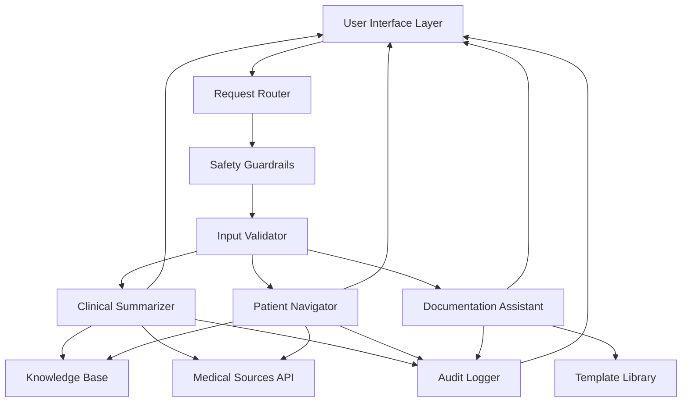

# Design Document: Healthcare AI Assistant

## Overview

The Healthcare AI Assistant is a multi-component AI system designed to support healthcare workflows through three primary capabilities: clinical information summarization, patient education and navigation, and documentation assistance. The system architecture prioritizes safety, accuracy, and transparency while operating exclusively on synthetic or publicly available data.

### Core Design Principles

1. **Safety First**: All outputs include appropriate disclaimers and limitation statements
2. **Transparency**: Clear source citations and uncertainty communication
3. **Compliance Awareness**: Built-in guardrails for data privacy and regulatory requirements
4. **Human-in-the-Loop**: System augments rather than replaces professional judgment
5. **Accuracy Verification**: Multi-layer validation and source verification

### Key Design Decisions

- **Modular Architecture**: Separate components for clinical, patient, and documentation workflows allow independent scaling and updates
- **Prompt Engineering Approach**: Use carefully crafted prompts with medical context rather than fine-tuning to maintain flexibility and reduce bias
- **Synthetic Data Only**: Strict input validation prevents processing of real patient data
- **Citation-First Design**: All medical information must be traceable to authoritative sources
- **Graceful Degradation**: System explicitly states when it cannot provide reliable information

## Architecture

### System Components



### Component Responsibilities

**User Interface Layer**
- Presents appropriate interface based on user type (healthcare professional vs patient)
- Displays limitation statements and disclaimers prominently
- Provides feedback collection mechanisms
- Formats outputs for readability

**Request Router**
- Classifies incoming requests by type (clinical, patient education, documentation)
- Routes to appropriate component
- Manages request prioritization

**Safety Guardrails**
- Detects potential real patient data in inputs
- Enforces synthetic data policy
- Blocks inappropriate requests (diagnosis, prescription)
- Injects limitation statements into all outputs

**Input Validator**
- Validates input format and structure
- Sanitizes inputs to prevent injection attacks
- Checks for completeness and clarity
- Requests clarification when needed

**Clinical Summarizer**
- Processes clinical information into structured summaries
- Retrieves and summarizes medical literature
- Highlights critical information and inconsistencies
- Maintains clinical context and terminology

**Patient Navigator**
- Translates medical concepts into plain language
- Provides care navigation guidance
- Generates educational content
- Detects emergency situations and escalates appropriately

**Documentation Assistant**
- Generates structured clinical documentation
- Suggests relevant medical codes (ICD-10, CPT)
- Validates documentation completeness
- Formats according to standard frameworks (SOAP notes)

**Knowledge Base**
- Stores curated medical knowledge from authoritative sources
- Maintains medical terminology and abbreviation mappings
- Provides quick reference for common conditions and treatments
- Regularly updated with current guidelines

**Medical Sources API**
- Interfaces with publicly available medical databases (PubMed, CDC, WHO)
- Retrieves peer-reviewed literature
- Accesses clinical guidelines and protocols
- Provides source metadata for citations

**Template Library**
- Stores documentation templates (SOAP notes, discharge summaries)
- Maintains format standards for different note types
- Provides code suggestion mappings
- Includes disclaimer and limitation statement templates

**Audit Logger**
- Records all system interactions with timestamps
- Logs user types and request categories
- Tracks feedback and error reports
- Generates compliance and usage reports

## Components and Interfaces

### Clinical Summarizer Interface

```typescript
interface ClinicalSummarizerInput {
  clinicalInformation: string;
  informationType: 'patient_context' | 'medical_literature' | 'research_query';
  urgencyLevel?: 'routine' | 'urgent' | 'emergency';
  context?: {
    specialty?: string;
    patientAge?: number; // synthetic
    relevantConditions?: string[];
  };
}

interface ClinicalSummarizerOutput {
  summary: {
    structuredContent: {
      symptoms?: string[];
      diagnoses?: string[];
      treatments?: string[];
      medicalHistory?: string[];
      criticalFindings?: string[];
      inconsistencies?: string[];
    };
    narrative: string;
  };
  sources: Source[];
  limitationStatement: string;
  confidence: 'high' | 'medium' | 'low';
  timestamp: string;
}

interface Source {
  title: string;
  authors?: string[];
  publication: string;
  publicationDate: string;
  url?: string;
  evidenceLevel?: string;
}
```

### Patient Navigator Interface

```typescript
interface PatientNavigatorInput {
  query: string;
  queryType: 'condition_info' | 'care_navigation' | 'resource_guidance';
  readingLevel?: 'basic' | 'intermediate' | 'advanced';
  preferredFormat?: 'text' | 'bullet_points' | 'visual_aids';
}

interface PatientNavigatorOutput {
  content: {
    mainExplanation: string;
    keyPoints: string[];
    visualAids?: string[]; // descriptions or references
    relatedTopics?: string[];
  };
  careGuidance?: {
    recommendedCareLevel: 'emergency' | 'urgent_care' | 'primary_care' | 'specialist' | 'self_care';
    reasoning: string;
    whatToExpect?: string;
  };
  resources?: Resource[];
  disclaimer: string;
  isEmergency: boolean;
  timestamp: string;
}

interface Resource {
  name: string;
  type: 'hotline' | 'website' | 'support_group' | 'educational_material';
  description: string;
  contactInfo?: string;
  url?: string;
}
```

### Documentation Assistant Interface

```typescript
interface DocumentationAssistantInput {
  encounterInfo: {
    chiefComplaint?: string;
    subjective?: string;
    objective?: {
      vitalSigns?: VitalSigns;
      physicalExam?: string;
      labResults?: string;
    };
    assessment?: string;
    plan?: string;
  };
  noteType: 'soap' | 'progress' | 'discharge' | 'consultation';
  specialty?: string;
}

interface VitalSigns {
  temperature?: number;
  bloodPressure?: string;
  heartRate?: number;
  respiratoryRate?: number;
  oxygenSaturation?: number;
}

interface DocumentationAssistantOutput {
  generatedNote: {
    formattedNote: string;
    sections: {
      subjective?: string;
      objective?: string;
      assessment?: string;
      plan?: string;
    };
  };
  suggestedCodes?: MedicalCode[];
  missingElements: string[];
  reviewNotice: string;
  timestamp: string;
}

interface MedicalCode {
  code: string;
  codeSystem: 'ICD-10' | 'CPT' | 'SNOMED';
  description: string;
  confidence: 'high' | 'medium' | 'low';
}
```

### Safety Guardrails Interface

```typescript
interface SafetyGuardrailsInput {
  rawInput: string;
  userType: 'healthcare_professional' | 'patient' | 'administrator';
  requestType: string;
}

interface SafetyGuardrailsOutput {
  isAllowed: boolean;
  reason?: string;
  sanitizedInput?: string;
  warnings: string[];
  requiredDisclaimers: string[];
}

interface GuardrailCheck {
  checkType: 'real_patient_data' | 'inappropriate_request' | 'emergency_detection' | 'input_validation';
  passed: boolean;
  details?: string;
}
```

## Data Models

### Core Data Structures

```typescript
// User Session
interface UserSession {
  sessionId: string;
  userType: 'healthcare_professional' | 'patient' | 'administrator';
  startTime: string;
  interactions: Interaction[];
  feedbackProvided: Feedback[];
}

// Interaction Record
interface Interaction {
  interactionId: string;
  timestamp: string;
  componentUsed: 'clinical_summarizer' | 'patient_navigator' | 'documentation_assistant';
  requestType: string;
  inputSummary: string; // sanitized, no PII
  outputSummary: string; // sanitized, no PII
  responseTime: number; // milliseconds
  userRating?: number; // 1-5
}

// Feedback
interface Feedback {
  feedbackId: string;
  timestamp: string;
  interactionId: string;
  rating: number; // 1-5
  category: 'accuracy' | 'completeness' | 'clarity' | 'usefulness' | 'safety_concern';
  comments?: string;
  issueType?: 'error' | 'missing_info' | 'unclear' | 'inappropriate';
}

// Knowledge Base Entry
interface KnowledgeEntry {
  entryId: string;
  topic: string;
  content: string;
  sources: Source[];
  lastUpdated: string;
  evidenceLevel: 'guideline' | 'systematic_review' | 'rct' | 'observational' | 'expert_opinion';
  specialty?: string[];
}

// Audit Log Entry
interface AuditLogEntry {
  logId: string;
  timestamp: string;
  sessionId: string;
  userType: string;
  action: string;
  componentAccessed: string;
  guardrailChecks: GuardrailCheck[];
  outcome: 'success' | 'blocked' | 'error';
  errorDetails?: string;
}

// Template
interface DocumentationTemplate {
  templateId: string;
  templateName: string;
  noteType: string;
  specialty?: string;
  sections: TemplateSection[];
  requiredFields: string[];
  disclaimerText: string;
}

interface TemplateSection {
  sectionName: string;
  sectionOrder: number;
  promptText: string;
  isRequired: boolean;
  validationRules?: string[];
}
```

### Data Flow Patterns

**Clinical Summarization Flow**
1. Healthcare professional submits clinical information
2. Safety guardrails validate input (no real patient data)
3. Input validator checks format and completeness
4. Clinical summarizer processes information
5. Knowledge base and medical sources provide context
6. Structured summary generated with citations
7. Limitation statement appended
8. Audit log records interaction
9. Output returned to user interface

**Patient Education Flow**
1. Patient submits health question
2. Safety guardrails check for emergency indicators
3. If emergency detected, immediate escalation with emergency contact info
4. Patient navigator retrieves relevant information from knowledge base
5. Content translated to appropriate reading level
6. Disclaimer and limitation statement added
7. Care navigation guidance provided if applicable
8. Audit log records interaction
9. Output returned with feedback option

**Documentation Assistance Flow**
1. Healthcare professional provides encounter information
2. Safety guardrails validate synthetic data usage
3. Documentation assistant selects appropriate template
4. Sections populated based on provided information
5. Missing elements identified and flagged
6. Medical codes suggested based on content
7. Review notice appended
8. Audit log records interaction
9. Draft documentation returned for professional review

## Correctness Properties

*A property is a characteristic or behavior that should hold true across all valid executions of a system—essentially, a formal statement about what the system should do. Properties serve as the bridge between human-readable specifications and machine-verifiable correctness guarantees.*


### Clinical Summarization Properties

**Property 1: Response Time Performance**
*For any* valid clinical information input, the Clinical_Summarizer should generate a structured summary within 10 seconds.
**Validates: Requirements 1.1**

**Property 2: Structured Output Completeness**
*For any* clinical information input, the generated summary should contain all required category fields: symptoms, diagnoses, treatments, and medical history sections.
**Validates: Requirements 1.2**

**Property 3: Critical Information Highlighting**
*For any* clinical information input containing critical data (allergies, contraindications, urgent findings), these elements should appear in the criticalFindings field of the output.
**Validates: Requirements 1.3**

**Property 4: Inconsistency Detection**
*For any* clinical information input containing conflicting or ambiguous data, the inconsistencies should be flagged in the inconsistencies field of the output.
**Validates: Requirements 1.4**

**Property 5: Literature Retrieval**
*For any* medical topic query, the Clinical_Summarizer should return a summary with content and at least one source citation.
**Validates: Requirements 2.1**

**Property 6: Complete Source Citations**
*For any* output containing medical information or literature summaries, all sources should include required fields: title, publication date, and authors (when applicable), and guideline sources should include issuing organization.
**Validates: Requirements 2.2, 7.1, 7.2**

**Property 7: Evidence Level Categorization**
*For any* literature summary output, sources should include evidence level metadata (guideline, systematic review, RCT, observational, expert opinion).
**Validates: Requirements 2.3**

**Property 8: Multiple Perspectives for Conflicts**
*For any* medical topic with known conflicting research, the output should present multiple perspectives with their respective evidence levels.
**Validates: Requirements 2.4**

**Property 9: Approved Source Types Only**
*For any* output with source citations, all sources should be from approved types: peer-reviewed publications, established medical databases, or recognized clinical guidelines.
**Validates: Requirements 2.5**

### Patient Navigation Properties

**Property 10: Plain Language Readability**
*For any* patient education output, the content should meet plain language standards with a Flesch-Kincaid reading level appropriate for general audiences (grade 8-10 or below).
**Validates: Requirements 3.1**

**Property 11: Medical Term Definitions**
*For any* patient education output containing medical terminology, technical terms should either be avoided or accompanied by clear definitions.
**Validates: Requirements 3.2**

**Property 12: Visual Aids or Analogies**
*For any* patient education output, the content should include either visual aid descriptions or analogies to enhance understanding.
**Validates: Requirements 3.3**

**Property 13: Care Level Recommendation**
*For any* patient symptom or health concern input, the output should include a care level recommendation from the set: emergency, urgent care, primary care, specialist, or self-care.
**Validates: Requirements 4.1**

**Property 14: Care Visit Expectations**
*For any* output providing care navigation guidance, it should include information about what to expect during the recommended type of medical visit.
**Validates: Requirements 4.2**

**Property 15: Resource Information Provision**
*For any* healthcare resource query, the output should include at least one resource with required fields: name, type, description, and contact information or URL.
**Validates: Requirements 4.3**

**Property 16: Emergency Detection and Response**
*For any* input containing emergency symptom patterns, the output should have isEmergency set to true and include emergency contact information.
**Validates: Requirements 4.4**

**Property 17: No Diagnosis or Prescription**
*For any* patient navigation output, the content should not contain diagnostic language (e.g., "you have", "diagnosis:") or prescriptive language (e.g., "take this medication", "prescription:").
**Validates: Requirements 4.5**

### Documentation Assistance Properties

**Property 18: Structured Documentation Format**
*For any* clinical encounter input, the Documentation_Assistant should generate output with all sections required by the specified note type (e.g., SOAP notes must have Subjective, Objective, Assessment, Plan sections).
**Validates: Requirements 5.1, 5.2**

**Property 19: Missing Element Detection**
*For any* incomplete clinical encounter input, the output should identify missing critical elements in the missingElements field.
**Validates: Requirements 5.3**

**Property 20: Medical Code Suggestions**
*For any* clinical encounter input, suggested medical codes should include both the code identifier and a description.
**Validates: Requirements 5.4**

### Safety and Compliance Properties

**Property 21: Real Patient Data Rejection**
*For any* input containing patterns indicative of real patient data (SSN patterns, specific identifiable dates, real names with context), the system should reject the request and display a data privacy warning.
**Validates: Requirements 6.1, 6.2**

**Property 22: Universal Limitation Statements**
*For any* output from any component (Clinical_Summarizer, Patient_Navigator, Documentation_Assistant), the response should include an appropriate limitation statement or disclaimer specific to the content type.
**Validates: Requirements 1.5, 3.5, 5.5, 6.3, 9.4, 9.5**

**Property 23: Audit Log Creation**
*For any* system interaction, an audit log entry should be created with required fields: timestamp, user type, request category, and outcome.
**Validates: Requirements 6.4**

**Property 24: Inappropriate Use Redirection**
*For any* input requesting diagnosis or treatment decisions, the output should include language redirecting the user to seek professional medical consultation.
**Validates: Requirements 6.5**

### Accuracy and Verification Properties

**Property 25: Uncertainty Communication**
*For any* output with low confidence level, the response should explicitly state the uncertainty and recommend verification.
**Validates: Requirements 7.3**

**Property 26: Unavailable Information Refusal**
*For any* query where reliable sources are not available, the system should refuse to provide information rather than generating unsourced content.
**Validates: Requirements 7.4**

**Property 27: Research Data Metadata**
*For any* output presenting statistical or research data, the response should include confidence levels or study limitations when available in the source.
**Validates: Requirements 7.5**

### Input Processing Properties

**Property 28: Text Input Acceptance**
*For any* valid text-based query or information input, the system should successfully process and return a response.
**Validates: Requirements 8.1**

**Property 29: Medical Terminology Handling**
*For any* input containing standard medical abbreviations (e.g., BP, HR, RR) or common misspellings, the system should correctly interpret and process the input.
**Validates: Requirements 8.2**

**Property 30: Clarification Requests**
*For any* deliberately incomplete input missing critical information, the system should request clarification before generating a full response.
**Validates: Requirements 8.3**

**Property 31: Structured Data Support**
*For any* input containing structured data formats (vital signs objects, lab value arrays, medication lists), the system should successfully parse and process the data.
**Validates: Requirements 8.4**

**Property 32: Output Formatting**
*For any* output, the response should include formatting elements such as headings, lists, or emphasis markers to enhance readability.
**Validates: Requirements 8.5**

### Transparency and Limitation Properties

**Property 33: Capability Boundary Communication**
*For any* out-of-scope request beyond system capabilities, the output should explicitly state what the system cannot do and suggest alternative resources.
**Validates: Requirements 9.3**

### Feedback System Properties

**Property 34: Rating Options Availability**
*For any* system interaction, rating options should be presented to allow users to rate response quality and accuracy.
**Validates: Requirements 10.1**

**Property 35: Feedback Submission**
*For any* user feedback submission, the system should accept and store the feedback with required fields: timestamp, interaction ID, rating, and category.
**Validates: Requirements 10.2**

**Property 36: Feedback Categorization**
*For any* stored feedback entry, it should include categorization by interaction type (clinical_summarization, patient_education, documentation).
**Validates: Requirements 10.3**

**Property 37: Feedback Privacy**
*For any* feedback submission, the system should validate that no real patient information is included in the feedback content.
**Validates: Requirements 10.4**

**Property 38: Feedback Report Generation**
*For any* request to generate feedback reports, the system should produce output with expected structure including feedback trends and common issues grouped by category.
**Validates: Requirements 10.5**

## Error Handling

### Error Categories and Responses

**Input Validation Errors**
- **Invalid Format**: Return clear error message specifying expected format
- **Missing Required Fields**: List all missing fields and request completion
- **Real Patient Data Detected**: Immediately reject with privacy warning, do not process
- **Malformed Structured Data**: Return parsing error with example of correct format

**Processing Errors**
- **Source Retrieval Failure**: Acknowledge inability to access sources, suggest retry or alternative query
- **Timeout**: Return partial results if available with timeout notice, or request simplified query
- **Ambiguous Input**: Request clarification with specific questions about ambiguous elements
- **Out of Scope**: Clearly state capability boundaries and suggest appropriate alternatives

**Safety Guardrail Triggers**
- **Emergency Detection**: Override normal flow, immediately display emergency guidance and contact information
- **Diagnosis/Prescription Request**: Politely decline, explain system limitations, redirect to professional
- **Inappropriate Content**: Reject request, explain acceptable use policy
- **Potential Real Patient Data**: Reject immediately, display privacy warning, log incident

**System Errors**
- **Component Failure**: Return graceful error message, log for investigation, suggest retry
- **Knowledge Base Unavailable**: Acknowledge limitation, suggest retry later, do not fabricate information
- **Audit Log Failure**: Continue processing but flag for administrative review
- **Template Not Found**: Use generic template or request manual specification

### Error Response Format

```typescript
interface ErrorResponse {
  error: {
    code: string;
    message: string;
    category: 'input_validation' | 'processing' | 'safety_guardrail' | 'system';
    userMessage: string; // Plain language explanation
    suggestedAction?: string;
    retryable: boolean;
  };
  timestamp: string;
  requestId: string;
}
```

### Error Handling Principles

1. **Never Fabricate**: If reliable information is unavailable, explicitly state this rather than generating unreliable content
2. **Clear Communication**: Error messages should be understandable by non-technical users
3. **Actionable Guidance**: Provide specific steps users can take to resolve the issue
4. **Safety Priority**: Safety-related errors (emergency detection, real patient data) take precedence over all other processing
5. **Graceful Degradation**: Provide partial results when possible rather than complete failure
6. **Audit Trail**: All errors should be logged for analysis and improvement

## Testing Strategy

### Dual Testing Approach

The Healthcare AI Assistant requires comprehensive testing using both unit tests and property-based tests. These approaches are complementary and both are necessary for ensuring system correctness and safety.

**Unit Tests** focus on:
- Specific examples of correct behavior
- Edge cases and boundary conditions
- Error handling scenarios
- Integration points between components
- Safety-critical specific cases (e.g., specific emergency symptoms)

**Property-Based Tests** focus on:
- Universal properties that hold across all inputs
- Comprehensive input coverage through randomization
- Verification of invariants and system guarantees
- Testing with diverse, generated data

### Property-Based Testing Configuration

**Testing Library**: We will use **fast-check** for TypeScript/JavaScript implementation, which provides robust property-based testing capabilities for the healthcare AI assistant.

**Test Configuration**:
- Minimum 100 iterations per property test (due to randomization and need for comprehensive coverage)
- Each property test must reference its design document property using the tag format
- Tag format: `// Feature: healthcare-ai-assistant, Property {number}: {property_text}`

**Example Property Test Structure**:

```typescript
import fc from 'fast-check';

// Feature: healthcare-ai-assistant, Property 1: Response Time Performance
test('Clinical summarizer generates summaries within 10 seconds', async () => {
  await fc.assert(
    fc.asyncProperty(
      fc.record({
        clinicalInformation: fc.string({ minLength: 10, maxLength: 5000 }),
        informationType: fc.constantFrom('patient_context', 'medical_literature', 'research_query'),
      }),
      async (input) => {
        const startTime = Date.now();
        const result = await clinicalSummarizer.summarize(input);
        const duration = Date.now() - startTime;
        
        expect(duration).toBeLessThan(10000);
        expect(result).toBeDefined();
      }
    ),
    { numRuns: 100 }
  );
});

// Feature: healthcare-ai-assistant, Property 22: Universal Limitation Statements
test('All outputs include appropriate limitation statements', async () => {
  await fc.assert(
    fc.asyncProperty(
      fc.oneof(
        generateClinicalInput(),
        generatePatientInput(),
        generateDocumentationInput()
      ),
      async (input) => {
        const result = await processInput(input);
        
        expect(result.limitationStatement || result.disclaimer || result.reviewNotice)
          .toBeDefined();
        expect(result.limitationStatement || result.disclaimer || result.reviewNotice)
          .toMatch(/professional|verification|review|educational|not a substitute/i);
      }
    ),
    { numRuns: 100 }
  );
});
```

### Test Coverage Requirements

**Component-Level Testing**:
- Clinical Summarizer: 15 properties, 20+ unit tests
- Patient Navigator: 8 properties, 15+ unit tests
- Documentation Assistant: 3 properties, 10+ unit tests
- Safety Guardrails: 4 properties, 25+ unit tests (safety-critical)
- Input Validator: 5 properties, 15+ unit tests
- Audit Logger: 1 property, 5+ unit tests

**Integration Testing**:
- End-to-end flows for each major use case
- Component interaction testing
- Error propagation testing
- Audit logging verification

**Safety Testing** (Critical):
- Real patient data detection with various patterns
- Emergency symptom detection with known emergency indicators
- Inappropriate request handling
- Limitation statement presence verification
- Source citation completeness

### Test Data Strategy

**Synthetic Data Generation**:
- Create generators for synthetic clinical information
- Generate diverse patient education queries
- Create varied documentation scenarios
- Include edge cases: empty inputs, very long inputs, special characters
- Generate inputs with known emergency patterns
- Create inputs with known inconsistencies for testing detection

**Public Data Usage**:
- Use publicly available medical literature for testing literature summarization
- Reference established medical guidelines for testing guideline handling
- Use public health information for patient education testing

**Test Data Principles**:
- Never use real patient data in tests
- Clearly mark all test data as synthetic
- Include diverse scenarios: different specialties, age groups, conditions
- Test with both common and rare medical scenarios
- Include multilingual medical terms and abbreviations

### Continuous Testing

- Run property-based tests on every commit (with reduced iterations for speed)
- Run full property-based test suite (100+ iterations) nightly
- Monitor test execution times to ensure performance requirements are met
- Track property test failure rates to identify areas needing improvement
- Maintain test coverage above 80% for all components
- Prioritize safety-critical component testing (aim for 95%+ coverage)

### Testing Limitations and Manual Review

Some requirements cannot be fully automated and require human review:
- Subjective quality assessment (e.g., "balanced presentation" in Requirement 3.4)
- Clinical accuracy of generated summaries (requires medical professional review)
- Appropriateness of care level recommendations (requires clinical validation)
- Quality of plain language explanations (requires readability expert review)

These aspects should be evaluated through:
- Regular manual review by healthcare professionals
- User feedback analysis
- Periodic clinical accuracy audits
- Usability testing with target user groups
