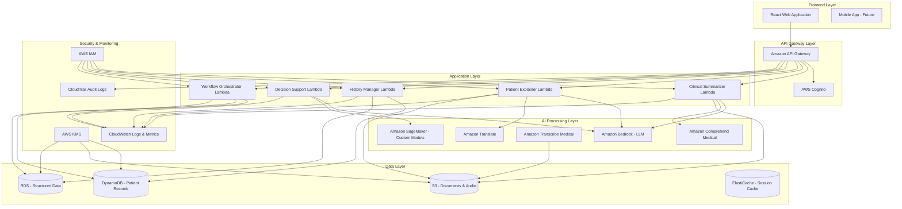
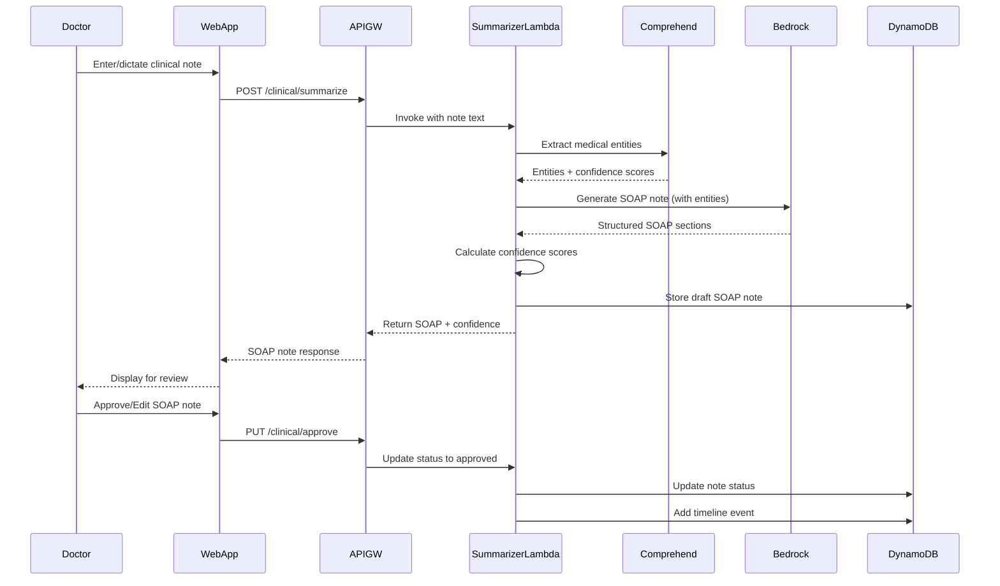
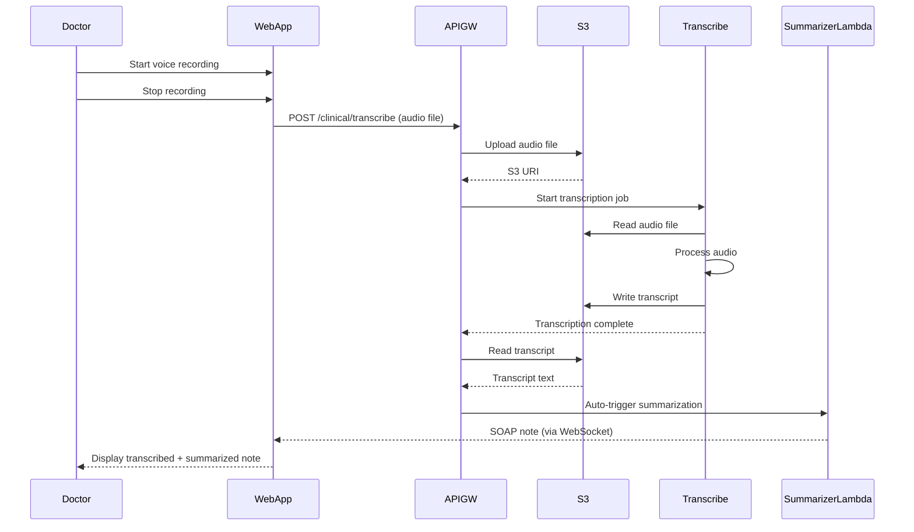
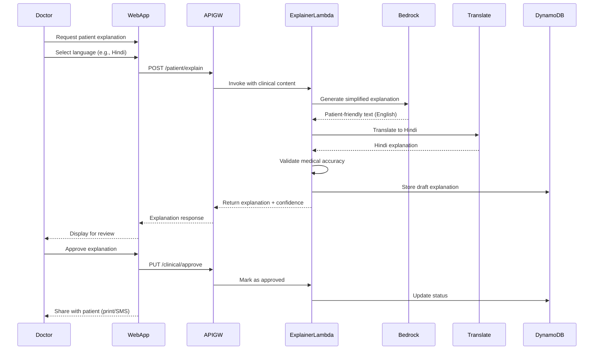
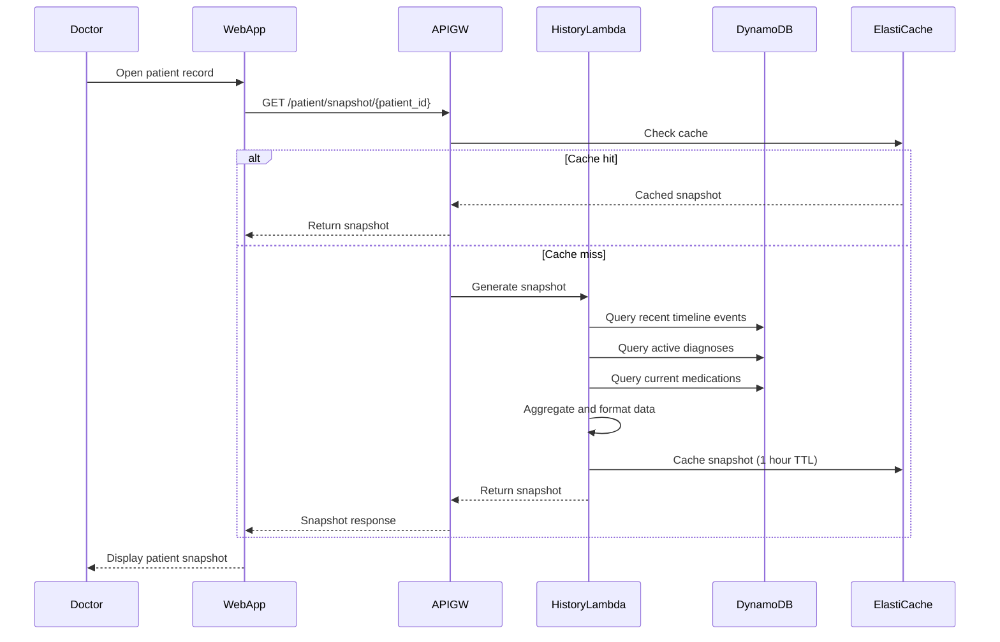
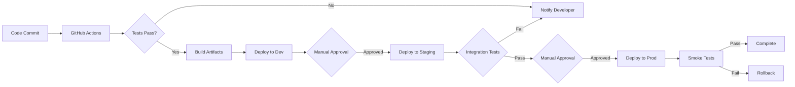

# Design Document: SwasthyaAI - AI Powered Clinical Intelligence Assistant

## 1. System Overview

SwasthyaAI is a cloud-native, AI-powered clinical intelligence platform built on AWS infrastructure. The system leverages Amazon Bedrock for generative AI, Amazon Comprehend Medical for entity extraction, Amazon Transcribe for voice-to-text, and Amazon Translate for multilingual support. The architecture follows a microservices pattern with clear separation between frontend, API layer, AI processing pipeline, and data storage.

The system is designed for high availability, scalability, and security, with built-in responsible AI safeguards including confidence scoring, human-in-the-loop approval workflows, and comprehensive audit logging. All components are deployed in AWS with encryption at rest and in transit, role-based access control, and compliance with HIPAA-equivalent standards.

**Key Design Principles**:
- **Human-in-the-Loop**: All AI outputs require explicit doctor approval
- **Assistive, Not Diagnostic**: AI provides insights, not clinical decisions
- **Security First**: Encryption, access controls, and audit logging throughout
- **Scalability**: Auto-scaling architecture to handle variable loads
- **Multilingual**: Native support for 10+ Indian languages
- **Responsible AI**: Confidence scoring, bias monitoring, explainability

## 2. High-Level Architecture




## 3. Component Architecture

### 3.1 Frontend Layer

**Technology**: React 18+ with TypeScript, Material-UI components

**Key Components**:
- **Clinical Dashboard**: Main interface for doctors showing patient list, pending tasks, notifications
- **Patient Record View**: Comprehensive patient information with timeline, snapshot, and clinical notes
- **SOAP Note Editor**: Interface for creating/editing clinical notes with voice input support
- **Approval Workflow UI**: Review and approve AI-generated content with side-by-side comparison
- **Patient Explanation Viewer**: Multilingual patient-friendly explanations with print/share options
- **Admin Console**: User management, audit logs, system configuration

**State Management**: Redux Toolkit for global state, React Query for server state caching

**Authentication**: AWS Cognito integration with JWT tokens, automatic token refresh

**Offline Support**: Service workers for basic offline functionality, sync when online

### 3.2 API Gateway Layer

**Service**: Amazon API Gateway (REST API)

**Features**:
- Request validation and transformation
- Rate limiting (100 requests/minute per user)
- CORS configuration for web clients
- Request/response logging
- API key management for external integrations

**Authentication**: AWS Cognito User Pools with OAuth 2.0

**Authorization**: Custom Lambda authorizer for role-based access control (RBAC)

**Endpoints**:
- `/clinical/summarize` - POST - Generate SOAP notes
- `/clinical/transcribe` - POST - Voice to text transcription
- `/clinical/approve` - PUT - Approve AI-generated content
- `/patient/explain` - POST - Generate patient explanations
- `/patient/history` - GET - Retrieve patient timeline
- `/patient/snapshot` - GET - Get patient snapshot
- `/decision-support/analyze` - POST - Get clinical insights
- `/workflow/tasks` - GET - Retrieve pending tasks
- `/admin/audit` - GET - Retrieve audit logs

### 3.3 Application Layer (AWS Lambda Functions)

#### Clinical Summarizer Lambda
**Runtime**: Python 3.11
**Memory**: 1024 MB
**Timeout**: 30 seconds
**Concurrency**: 100 reserved concurrent executions

**Responsibilities**:
- Receive unstructured clinical text or transcribed audio
- Call Amazon Comprehend Medical for entity extraction
- Call Amazon Bedrock (Claude 3 Sonnet) for SOAP generation
- Calculate confidence scores for each SOAP section
- Store draft SOAP note in DynamoDB
- Return structured SOAP note with confidence scores

**Error Handling**: Retry with exponential backoff, fallback to simpler model if primary fails

#### Patient Explainer Lambda
**Runtime**: Python 3.11
**Memory**: 512 MB
**Timeout**: 20 seconds

**Responsibilities**:
- Receive clinical content and target language
- Call Amazon Bedrock for patient-friendly explanation generation
- Call Amazon Translate for multilingual translation
- Validate medical accuracy of simplified content
- Store draft explanation in DynamoDB
- Return explanation with confidence score

#### History Manager Lambda
**Runtime**: Node.js 18
**Memory**: 512 MB
**Timeout**: 10 seconds

**Responsibilities**:
- Manage patient timeline events (CRUD operations)
- Query and filter patient history
- Aggregate historical data for snapshot generation
- Maintain data integrity and version control
- Handle concurrent updates with optimistic locking

#### Decision Support Lambda
**Runtime**: Python 3.11
**Memory**: 1024 MB
**Timeout**: 30 seconds

**Responsibilities**:
- Analyze patient data for clinical insights
- Check drug interactions using knowledge base
- Retrieve relevant clinical guidelines
- Generate assistive recommendations (non-diagnostic)
- Calculate confidence scores for insights
- Log all decision support queries for audit

#### Workflow Orchestrator Lambda
**Runtime**: Node.js 18
**Memory**: 512 MB
**Timeout**: 15 seconds

**Responsibilities**:
- Manage approval workflows
- Route tasks to appropriate users
- Send notifications for pending approvals
- Trigger downstream actions on approval
- Handle workflow state transitions
- Maintain workflow audit trail

### 3.4 AI Processing Layer

#### Amazon Bedrock
**Model**: Claude 3 Sonnet (primary), Claude 3 Haiku (fallback)

**Use Cases**:
- SOAP note generation from unstructured text
- Patient-friendly explanation generation
- Discharge summary generation
- Clinical insight generation

**Prompt Engineering Strategy**:
- Few-shot learning with example SOAP notes
- Structured output format specification
- Medical terminology preservation instructions
- Confidence score self-assessment prompts

**Configuration**:
- Temperature: 0.3 (low for consistency)
- Max tokens: 2000
- Top-p: 0.9

#### Amazon Comprehend Medical
**Features Used**:
- Entity detection (conditions, medications, procedures, anatomy)
- PHI detection (for redaction in prototype)
- ICD-10-CM and RxNorm linking

**Batch Processing**: Process multiple notes in parallel for efficiency

**Confidence Threshold**: 0.7 minimum for entity acceptance

#### Amazon Transcribe Medical
**Configuration**:
- Language: English (en-US), Hindi (hi-IN)
- Specialty: Primary Care
- Type: Conversation
- Medical vocabulary: Custom vocabulary for Indian medical terms

**Audio Format**: WAV, MP3, FLAC (16kHz minimum sample rate)

**Real-time vs Batch**: Real-time for live dictation, batch for uploaded audio

#### Amazon Translate
**Language Pairs**:
- English → Hindi, Tamil, Telugu, Bengali, Marathi, Gujarati, Kannada, Malayalam, Punjabi
- Custom terminology for medical terms

**Quality Assurance**: Medical terminology validation post-translation

#### Amazon SageMaker
**Custom Models**:
- Confidence score calibration model
- Bias detection model
- Medical entity disambiguation model

**Deployment**: Real-time endpoints with auto-scaling

**Monitoring**: Model performance metrics, drift detection

### 3.5 Data Storage Layer

#### Amazon DynamoDB
**Tables**:

**Patients Table**:
- Partition Key: `patient_id` (UUID)
- Attributes: demographics, contact, insurance, created_at, updated_at
- GSI: `hospital_id-created_at-index` for hospital-level queries

**ClinicalNotes Table**:
- Partition Key: `patient_id`
- Sort Key: `note_id` (timestamp-based)
- Attributes: note_type, content, soap_sections, entities, status, confidence_scores, created_by, approved_by, approved_at
- GSI: `status-created_at-index` for pending approval queries

**Timeline Table**:
- Partition Key: `patient_id`
- Sort Key: `event_timestamp`
- Attributes: event_type, event_data, entities, source_note_id
- LSI: `event_type-event_timestamp-index` for filtering by type

**ApprovalWorkflow Table**:
- Partition Key: `workflow_id`
- Attributes: content_type, content_id, status, assigned_to, created_at, completed_at
- GSI: `assigned_to-status-index` for user task lists

**Configuration**:
- On-demand billing for variable workloads
- Point-in-time recovery enabled
- Encryption at rest with AWS KMS
- DynamoDB Streams for change data capture

#### Amazon S3
**Buckets**:

**clinical-audio-{env}**:
- Store voice recordings
- Lifecycle policy: Delete after 90 days
- Versioning enabled
- Server-side encryption with KMS

**clinical-documents-{env}**:
- Store discharge summaries, reports
- Lifecycle policy: Transition to Glacier after 1 year
- Versioning enabled
- Object lock for compliance

**ai-model-artifacts-{env}**:
- Store SageMaker model artifacts
- Versioning enabled

**Configuration**:
- Block public access enabled
- Access logging to separate audit bucket
- Cross-region replication for disaster recovery

#### Amazon RDS (PostgreSQL)
**Use Cases**:
- Structured patient demographics
- User management and roles
- Audit logs (long-term storage)
- Analytics and reporting queries

**Configuration**:
- Multi-AZ deployment for high availability
- Automated backups (7-day retention)
- Encryption at rest with KMS
- Read replicas for analytics queries

**Schema**:
- `users` - Doctor and admin accounts
- `hospitals` - Hospital/clinic information
- `audit_logs` - Comprehensive audit trail
- `system_config` - Application configuration

#### Amazon ElastiCache (Redis)
**Use Cases**:
- Session management
- API response caching
- Rate limiting counters
- Real-time notification queues

**Configuration**:
- Cluster mode enabled
- Automatic failover
- Encryption in transit and at rest
- 1-hour TTL for most cached data


## 4. Data Flow Description

### 4.1 Clinical Note Summarization Flow



### 4.2 Voice-to-Text Transcription Flow



### 4.3 Patient Explanation Generation Flow



### 4.4 Patient Snapshot Generation Flow



## 5. Longitudinal Patient History Design

### 5.1 Data Model

**Timeline Event Structure**:
```json
{
  "patient_id": "uuid",
  "event_timestamp": "2024-01-15T10:30:00Z",
  "event_id": "uuid",
  "event_type": "consultation|procedure|medication|lab_result|diagnosis|admission|discharge",
  "event_data": {
    "title": "General Consultation",
    "description": "Follow-up for hypertension",
    "provider": "Dr. Priya Sharma",
    "location": "OPD-3",
    "clinical_note_id": "uuid",
    "entities": [
      {
        "type": "condition",
        "text": "Hypertension",
        "code": "I10",
        "ontology": "ICD-10"
      },
      {
        "type": "medication",
        "text": "Amlodipine 5mg",
        "code": "197361",
        "ontology": "RxNorm"
      }
    ],
    "vitals": {
      "bp": "140/90",
      "pulse": "78",
      "temperature": "98.6"
    }
  },
  "source": "clinical_note|manual_entry|import",
  "created_by": "doctor_id",
  "created_at": "2024-01-15T10:35:00Z"
}
```

**Patient Snapshot Structure**:
```json
{
  "patient_id": "uuid",
  "generated_at": "2024-01-15T11:00:00Z",
  "active_diagnoses": [
    {
      "condition": "Hypertension",
      "icd10": "I10",
      "diagnosed_date": "2023-06-10",
      "status": "active"
    },
    {
      "condition": "Type 2 Diabetes",
      "icd10": "E11",
      "diagnosed_date": "2023-08-15",
      "status": "active"
    }
  ],
  "current_medications": [
    {
      "medication": "Amlodipine 5mg",
      "dosage": "Once daily",
      "started_date": "2023-06-10",
      "prescriber": "Dr. Priya Sharma"
    },
    {
      "medication": "Metformin 500mg",
      "dosage": "Twice daily",
      "started_date": "2023-08-15",
      "prescriber": "Dr. Rajesh Kumar"
    }
  ],
  "allergies": [
    {
      "allergen": "Penicillin",
      "reaction": "Rash",
      "severity": "moderate"
    }
  ],
  "recent_vitals": {
    "bp": "140/90",
    "pulse": "78",
    "weight": "72kg",
    "bmi": "24.5",
    "recorded_at": "2024-01-15T10:30:00Z"
  },
  "recent_visits": [
    {
      "date": "2024-01-15",
      "type": "consultation",
      "provider": "Dr. Priya Sharma",
      "chief_complaint": "Follow-up"
    },
    {
      "date": "2023-12-10",
      "type": "consultation",
      "provider": "Dr. Priya Sharma",
      "chief_complaint": "Routine check-up"
    }
  ],
  "upcoming_appointments": [
    {
      "date": "2024-02-15",
      "type": "follow-up",
      "provider": "Dr. Priya Sharma"
    }
  ],
  "flags": [
    {
      "type": "allergy",
      "message": "Penicillin allergy",
      "severity": "high"
    },
    {
      "type": "chronic_condition",
      "message": "Diabetic - monitor blood sugar",
      "severity": "medium"
    }
  ]
}
```

### 5.2 Timeline Structure

**Event Categories**:
1. **Clinical Encounters**: Consultations, admissions, discharges
2. **Diagnostic Events**: Lab results, imaging studies, biopsies
3. **Therapeutic Events**: Medications started/stopped, procedures performed
4. **Administrative Events**: Referrals, insurance approvals, billing

**Timeline Visualization**:
- Chronological view (default): Events sorted by timestamp, most recent first
- Category view: Events grouped by type with expandable sections
- Condition-centric view: Events filtered by specific diagnosis
- Date range filter: Custom date range selection

**Timeline Query Patterns**:
- Get all events for patient (paginated)
- Get events by type (e.g., all medications)
- Get events by date range
- Get events containing specific entity (e.g., all mentions of "Diabetes")
- Get events by provider

### 5.3 Snapshot Aggregation Logic

**Aggregation Rules**:

1. **Active Diagnoses**: 
   - Include all diagnoses from last 2 years
   - Exclude diagnoses marked as "resolved"
   - Sort by severity and recency

2. **Current Medications**:
   - Include medications with no stop date
   - Include medications started in last 6 months
   - Exclude medications explicitly discontinued

3. **Recent Vitals**:
   - Use most recent vital signs (within 30 days)
   - If no recent vitals, show last recorded with timestamp

4. **Allergies**:
   - Include all documented allergies (no time limit)
   - Highlight high-severity allergies

5. **Recent Visits**:
   - Last 5 clinical encounters
   - Include date, provider, chief complaint

6. **Flags**:
   - Critical allergies
   - Chronic conditions requiring monitoring
   - Overdue follow-ups
   - Drug interaction warnings

**Caching Strategy**:
- Cache snapshots in ElastiCache with 1-hour TTL
- Invalidate cache on new clinical note approval
- Pre-generate snapshots for scheduled appointments

**Performance Optimization**:
- Use DynamoDB GSI for efficient queries
- Parallel queries for different data types
- Limit timeline queries to last 6 months for snapshot
- Lazy load full timeline on user request


## 6. AI Processing Pipeline

### 6.1 Transcription Pipeline

**Input**: Audio file (WAV, MP3, FLAC)
**Output**: Transcribed text with timestamps

**Process**:
1. **Audio Upload**: Client uploads audio to S3 via pre-signed URL
2. **Transcription Job**: Lambda triggers Amazon Transcribe Medical job
3. **Processing**: Transcribe processes audio with medical vocabulary
4. **Post-Processing**: 
   - Remove filler words (um, uh, like)
   - Capitalize medical terms
   - Add punctuation
5. **Storage**: Store transcript in DynamoDB linked to audio file
6. **Notification**: Notify client via WebSocket when complete

**Configuration**:
```python
transcribe_config = {
    "LanguageCode": "en-US",  # or "hi-IN"
    "MediaFormat": "wav",
    "MediaSampleRateHertz": 16000,
    "Specialty": "PRIMARYCARE",
    "Type": "CONVERSATION",
    "Settings": {
        "VocabularyName": "indian-medical-terms",
        "ShowSpeakerLabels": True,
        "MaxSpeakerLabels": 2
    }
}
```

**Custom Vocabulary**: Indian medical terms, drug names, hospital names

### 6.2 Entity Extraction Pipeline

**Input**: Clinical text (note, transcript, report)
**Output**: Structured medical entities with confidence scores

**Process**:
1. **Text Preprocessing**: Clean and normalize text
2. **Entity Detection**: Call Amazon Comprehend Medical
3. **Entity Types Extracted**:
   - MEDICATION (drug names, dosages, frequencies)
   - CONDITION (diagnoses, symptoms, diseases)
   - PROCEDURE (surgeries, tests, treatments)
   - ANATOMY (body parts, organs)
   - TEST_TREATMENT_PROCEDURE
   - PROTECTED_HEALTH_INFORMATION (for redaction)
4. **Ontology Linking**: Map entities to ICD-10, SNOMED CT, RxNorm
5. **Confidence Filtering**: Discard entities with confidence < 0.7
6. **Disambiguation**: Use SageMaker model for ambiguous entities
7. **Storage**: Store entities in DynamoDB with source text reference

**Entity Structure**:
```json
{
  "entity_id": "uuid",
  "text": "Hypertension",
  "type": "CONDITION",
  "category": "MEDICAL_CONDITION",
  "score": 0.95,
  "begin_offset": 45,
  "end_offset": 57,
  "attributes": [
    {
      "type": "ACUITY",
      "score": 0.89,
      "relationship_score": 0.92,
      "text": "chronic"
    }
  ],
  "traits": [
    {
      "name": "DIAGNOSIS",
      "score": 0.94
    }
  ],
  "icd10_codes": ["I10"],
  "snomed_codes": ["38341003"]
}
```

### 6.3 SOAP Summarization Pipeline

**Input**: Unstructured clinical text + extracted entities
**Output**: Structured SOAP note with confidence scores

**Process**:
1. **Context Preparation**: Combine input text with extracted entities
2. **Prompt Construction**: Build few-shot prompt with examples
3. **LLM Invocation**: Call Amazon Bedrock (Claude 3 Sonnet)
4. **Response Parsing**: Extract SOAP sections from LLM response
5. **Confidence Calculation**: 
   - Entity coverage score (% of entities included)
   - Coherence score (internal consistency)
   - Completeness score (all SOAP sections present)
   - Overall confidence = weighted average
6. **Validation**: Check for medical contradictions
7. **Storage**: Store draft SOAP note with confidence scores

**Prompt Template**:
```
You are a medical documentation assistant. Convert the following clinical note into a structured SOAP format.

Input Clinical Note:
{clinical_text}

Extracted Medical Entities:
{entities_json}

Generate a SOAP note with the following sections:
- Subjective: Patient's reported symptoms and history
- Objective: Observable findings, vitals, examination results
- Assessment: Clinical diagnosis and interpretation
- Plan: Treatment plan, medications, follow-up

Requirements:
- Preserve all medical entities from the input
- Use professional medical terminology
- Be concise but complete
- Include confidence assessment for each section (0-1 scale)

Output Format:
{
  "subjective": "...",
  "subjective_confidence": 0.95,
  "objective": "...",
  "objective_confidence": 0.90,
  "assessment": "...",
  "assessment_confidence": 0.85,
  "plan": "...",
  "plan_confidence": 0.88
}
```

**Confidence Score Calculation**:
```python
def calculate_soap_confidence(soap_note, entities, original_text):
    # Entity coverage: % of extracted entities included in SOAP
    entity_coverage = count_entities_in_soap(soap_note, entities) / len(entities)
    
    # Completeness: All SOAP sections present and non-empty
    completeness = 1.0 if all_sections_present(soap_note) else 0.5
    
    # Coherence: No contradictions between sections
    coherence = check_coherence(soap_note)
    
    # Length appropriateness: Not too short or too long
    length_score = evaluate_length(soap_note, original_text)
    
    # Weighted average
    overall_confidence = (
        0.4 * entity_coverage +
        0.3 * completeness +
        0.2 * coherence +
        0.1 * length_score
    )
    
    return overall_confidence
```

### 6.4 Patient Explanation Pipeline

**Input**: Clinical content (SOAP note, diagnosis, treatment plan)
**Output**: Patient-friendly explanation in target language

**Process**:
1. **Content Selection**: Extract key information for patient
2. **Simplification Prompt**: Build prompt for patient-friendly language
3. **LLM Invocation**: Call Amazon Bedrock for simplification
4. **Medical Validation**: Ensure accuracy is preserved
5. **Translation**: Call Amazon Translate for target language
6. **Post-Translation Validation**: Check medical term translations
7. **Readability Check**: Verify 6th-8th grade reading level
8. **Storage**: Store draft explanation with confidence score

**Simplification Prompt Template**:
```
You are a medical communication expert. Explain the following medical information in simple, patient-friendly language.

Medical Content:
{clinical_content}

Target Audience: Patient with limited medical knowledge
Reading Level: 6th-8th grade
Language: Simple, clear, empathetic

Guidelines:
- Avoid medical jargon; use everyday words
- Use analogies and examples when helpful
- Be reassuring but honest
- Include what the patient should do next
- Keep sentences short and clear

Generate a patient-friendly explanation.
```

**Translation Configuration**:
```python
translate_config = {
    "SourceLanguageCode": "en",
    "TargetLanguageCode": "hi",  # or other Indian language
    "TerminologyNames": ["medical-terms-en-hi"],
    "Settings": {
        "Formality": "FORMAL",
        "Profanity": "MASK"
    }
}
```

**Custom Terminology**: Medical terms with approved translations in each language

### 6.5 Decision Support Pipeline

**Input**: Patient data (history, current condition, medications)
**Output**: Assistive clinical insights (non-diagnostic)

**Process**:
1. **Data Aggregation**: Collect relevant patient information
2. **Drug Interaction Check**: Query drug interaction database
3. **Guideline Retrieval**: Fetch relevant clinical guidelines
4. **Similar Case Search**: Find similar cases in knowledge base
5. **Insight Generation**: Call Amazon Bedrock for insights
6. **Confidence Scoring**: Calculate reliability of insights
7. **Non-Diagnostic Validation**: Ensure no diagnostic conclusions
8. **Flagging**: Mark critical interactions or contraindications
9. **Storage**: Log all decision support queries for audit

**Insight Types**:
- **Drug Interactions**: "Amlodipine and Simvastatin may interact; monitor for muscle pain"
- **Guideline Recommendations**: "ADA guidelines suggest HbA1c target <7% for this patient"
- **Similar Cases**: "3 similar cases in database; average treatment duration: 6 weeks"
- **Contraindications**: "Patient has documented Penicillin allergy; avoid beta-lactam antibiotics"
- **Monitoring Suggestions**: "Consider monitoring renal function given long-term NSAID use"

**Decision Support Prompt Template**:
```
You are a clinical decision support assistant. Analyze the patient data and provide assistive insights.

Patient Data:
{patient_snapshot}

Current Clinical Context:
{current_note}

Provide assistive insights in these categories:
1. Drug Interactions: Check for interactions between current medications
2. Guideline Recommendations: Relevant clinical guidelines
3. Monitoring Suggestions: What should be monitored
4. Contraindications: Any contraindications to consider

IMPORTANT:
- Do NOT provide diagnostic conclusions
- Do NOT recommend specific treatments
- Label all insights as "Assistive" and "For Consideration"
- Include confidence scores and evidence sources
- Flag critical interactions with HIGH priority

Output Format:
{
  "insights": [
    {
      "category": "drug_interaction",
      "priority": "high|medium|low",
      "message": "...",
      "evidence": "...",
      "confidence": 0.92
    }
  ]
}
```

### 6.6 Confidence Scoring System

**Confidence Score Components**:

1. **Model Confidence**: Native confidence from AI model
2. **Entity Coverage**: % of extracted entities used in output
3. **Completeness**: All required sections present
4. **Coherence**: No internal contradictions
5. **Validation**: Passes medical validation checks

**Confidence Levels**:
- **High (0.85-1.0)**: Auto-approve for review (green flag)
- **Medium (0.70-0.84)**: Standard review required (yellow flag)
- **Low (<0.70)**: Mandatory detailed review (red flag)

**Calibration**:
- Use SageMaker model trained on historical approval data
- Continuously update based on doctor feedback
- A/B test different confidence thresholds

**Display to Users**:
```
Confidence: ████████░░ 85% (High)
✓ All entities included
✓ Complete SOAP sections
✓ No contradictions detected
⚠ Review assessment section
```


## 7. Security Architecture

### 7.1 Authentication and Authorization

**Authentication**: AWS Cognito User Pools

**User Types**:
- **Doctors**: Full access to patient records, AI features, approval workflows
- **Administrators**: User management, audit logs, system configuration
- **Patients** (future): View-only access to own records and explanations

**Authentication Flow**:
1. User enters credentials in web app
2. Cognito validates credentials
3. Cognito returns JWT tokens (ID token, Access token, Refresh token)
4. Web app stores tokens securely (httpOnly cookies)
5. API requests include access token in Authorization header
6. API Gateway validates token with Cognito
7. Custom authorizer checks role-based permissions

**Multi-Factor Authentication (MFA)**:
- Required for all doctor and admin accounts
- SMS or TOTP (Google Authenticator) options
- Enforced at Cognito level

**Authorization**: Role-Based Access Control (RBAC)

**Roles and Permissions**:
```json
{
  "roles": {
    "doctor": {
      "permissions": [
        "read:patient_records",
        "write:clinical_notes",
        "approve:ai_content",
        "generate:patient_explanations",
        "access:decision_support"
      ]
    },
    "senior_doctor": {
      "inherits": "doctor",
      "permissions": [
        "approve:critical_cases",
        "override:ai_flags"
      ]
    },
    "admin": {
      "permissions": [
        "manage:users",
        "read:audit_logs",
        "configure:system",
        "manage:hospitals"
      ]
    }
  }
}
```

**Custom Lambda Authorizer**:
```python
def lambda_handler(event, context):
    token = event['authorizationToken']
    
    # Validate JWT token
    claims = validate_jwt(token)
    
    # Extract user role
    user_role = claims['custom:role']
    
    # Check permissions for requested resource
    resource = event['methodArn']
    if has_permission(user_role, resource):
        return generate_allow_policy(claims['sub'], resource)
    else:
        return generate_deny_policy(claims['sub'], resource)
```

### 7.2 Data Encryption

**Encryption at Rest**:
- **DynamoDB**: AWS KMS encryption with customer-managed keys (CMK)
- **S3**: Server-side encryption with KMS (SSE-KMS)
- **RDS**: Transparent Data Encryption (TDE) with KMS
- **ElastiCache**: Encryption at rest enabled

**Encryption in Transit**:
- **API Gateway**: TLS 1.3 only
- **Lambda to AWS Services**: HTTPS/TLS
- **Database Connections**: SSL/TLS enforced
- **Web App**: HTTPS with HSTS headers

**Key Management**:
- **AWS KMS**: Customer-managed keys (CMK) for all encryption
- **Key Rotation**: Automatic annual rotation enabled
- **Key Policies**: Least privilege access to keys
- **Audit**: CloudTrail logs all key usage

**Encryption Configuration**:
```python
# DynamoDB encryption
dynamodb_encryption = {
    "SSESpecification": {
        "Enabled": True,
        "SSEType": "KMS",
        "KMSMasterKeyId": "arn:aws:kms:region:account:key/key-id"
    }
}

# S3 encryption
s3_encryption = {
    "ServerSideEncryptionConfiguration": {
        "Rules": [{
            "ApplyServerSideEncryptionByDefault": {
                "SSEAlgorithm": "aws:kms",
                "KMSMasterKeyID": "arn:aws:kms:region:account:key/key-id"
            },
            "BucketKeyEnabled": True
        }]
    }
}
```

### 7.3 Network Security

**VPC Configuration**:
- Lambda functions in private subnets
- RDS in private subnets (no public access)
- NAT Gateway for outbound internet access
- VPC endpoints for AWS services (S3, DynamoDB, KMS)

**Security Groups**:
- Restrictive inbound rules (only necessary ports)
- Outbound rules limited to required destinations
- Separate security groups for each tier

**Network ACLs**:
- Stateless firewall rules at subnet level
- Deny all by default, allow specific traffic

**API Gateway**:
- Resource policies to restrict access
- WAF (Web Application Firewall) for DDoS protection
- Rate limiting per user and IP
- Request validation to prevent injection attacks

**WAF Rules**:
- SQL injection protection
- XSS (Cross-Site Scripting) protection
- Rate-based rules (100 requests/5 minutes per IP)
- Geo-blocking (allow India only for prototype)
- Known bad inputs blocking

### 7.4 Audit Logging

**CloudTrail**:
- All API calls logged
- Management events and data events
- Log file integrity validation
- Logs stored in S3 with encryption
- 7-year retention

**CloudWatch Logs**:
- Application logs from Lambda functions
- API Gateway access logs
- VPC Flow Logs
- Log groups with encryption
- 90-day retention (then archive to S3)

**Application Audit Logs** (in RDS):
```sql
CREATE TABLE audit_logs (
    log_id UUID PRIMARY KEY,
    timestamp TIMESTAMP NOT NULL,
    user_id UUID NOT NULL,
    user_role VARCHAR(50),
    action VARCHAR(100) NOT NULL,
    resource_type VARCHAR(50),
    resource_id UUID,
    ip_address INET,
    user_agent TEXT,
    request_data JSONB,
    response_status INTEGER,
    ai_model_version VARCHAR(50),
    confidence_score DECIMAL(3,2),
    approval_status VARCHAR(20),
    notes TEXT
);

CREATE INDEX idx_audit_user_timestamp ON audit_logs(user_id, timestamp DESC);
CREATE INDEX idx_audit_action_timestamp ON audit_logs(action, timestamp DESC);
CREATE INDEX idx_audit_resource ON audit_logs(resource_type, resource_id);
```

**Logged Events**:
- User authentication (login, logout, MFA)
- Patient record access (read, write, delete)
- AI content generation (SOAP, explanations, insights)
- Approval actions (approve, reject, edit)
- Configuration changes
- User management actions
- Data exports
- Failed access attempts

**Log Retention**:
- CloudWatch Logs: 90 days
- CloudTrail: 7 years
- Application audit logs: 7 years
- Access logs: 1 year

### 7.5 Data Privacy and Compliance

**PHI Protection** (for production):
- Minimum necessary access principle
- De-identification for analytics
- Secure data disposal procedures
- Patient consent management

**Synthetic Data Handling** (for prototype):
- Clear labeling as "Synthetic Data"
- No real PHI in development/staging
- Synthetic data generation using Synthea
- Watermarking of synthetic records

**Compliance Standards**:
- HIPAA-equivalent security controls
- GDPR principles (for future EU expansion)
- Indian IT Act compliance
- Medical Council of India guidelines

**Data Residency**:
- All data stored in AWS India regions (Mumbai, Hyderabad)
- No cross-border data transfer
- Regional failover within India

**Patient Rights** (for production):
- Right to access medical records
- Right to correct inaccurate data
- Right to data portability
- Right to deletion (with legal exceptions)

### 7.6 Incident Response

**Security Monitoring**:
- AWS GuardDuty for threat detection
- CloudWatch alarms for anomalies
- Failed login attempt monitoring
- Unusual API activity detection

**Incident Response Plan**:
1. **Detection**: Automated alerts trigger incident
2. **Containment**: Isolate affected resources
3. **Investigation**: Analyze logs and determine scope
4. **Eradication**: Remove threat and patch vulnerabilities
5. **Recovery**: Restore services from backups
6. **Post-Incident**: Document lessons learned

**Automated Responses**:
- Block IP after 5 failed login attempts
- Revoke compromised credentials automatically
- Isolate compromised Lambda functions
- Notify security team via SNS

**Backup and Recovery**:
- DynamoDB point-in-time recovery (35 days)
- RDS automated backups (7 days)
- S3 versioning and cross-region replication
- Regular disaster recovery drills


## 8. Responsible AI Design

### 8.1 AI Safety Principles

**Core Principles**:
1. **Human-in-the-Loop**: All AI outputs require doctor approval
2. **Assistive, Not Autonomous**: AI supports, never replaces clinical judgment
3. **Transparency**: Clear confidence scores and explainability
4. **Non-Diagnostic**: No autonomous diagnostic conclusions
5. **Bias Monitoring**: Continuous monitoring for demographic bias
6. **Continuous Learning**: Feedback loops for improvement
7. **Fail-Safe**: Graceful degradation when AI confidence is low

### 8.2 Confidence Scoring and Thresholds

**Confidence Score Display**:
```
┌─────────────────────────────────────┐
│ SOAP Note - Draft                   │
│ Confidence: 87% (High) ✓            │
├─────────────────────────────────────┤
│ Subjective: 92% ✓                   │
│ Objective: 85% ✓                    │
│ Assessment: 78% ⚠                   │
│ Plan: 91% ✓                         │
└─────────────────────────────────────┘
```

**Threshold Actions**:
- **≥85%**: Green flag, standard review
- **70-84%**: Yellow flag, careful review recommended
- **<70%**: Red flag, mandatory detailed review and edit

**Confidence Factors**:
- Entity extraction confidence
- LLM generation confidence
- Medical validation score
- Historical approval rate for similar cases

### 8.3 Bias Detection and Mitigation

**Monitored Bias Dimensions**:
- Gender bias in language and recommendations
- Age bias in treatment suggestions
- Socioeconomic bias in care assumptions
- Geographic bias (urban vs rural)
- Language bias in multilingual content

**Bias Detection Methods**:
1. **Statistical Analysis**: Compare AI outputs across demographic groups
2. **Fairness Metrics**: Measure disparate impact
3. **Human Review**: Regular audits by diverse medical panel
4. **Feedback Analysis**: Track approval rates by patient demographics

**Mitigation Strategies**:
- Diverse training data representation
- Bias-aware prompt engineering
- Regular model retraining with balanced data
- Explicit fairness constraints in model training
- Human oversight for flagged cases

**Bias Monitoring Dashboard**:
```python
bias_metrics = {
    "gender": {
        "male_approval_rate": 0.87,
        "female_approval_rate": 0.85,
        "disparity_ratio": 1.02,  # <1.2 is acceptable
        "status": "OK"
    },
    "age": {
        "young_approval_rate": 0.88,
        "elderly_approval_rate": 0.84,
        "disparity_ratio": 1.05,
        "status": "OK"
    },
    "language": {
        "english_accuracy": 0.92,
        "hindi_accuracy": 0.89,
        "disparity_ratio": 1.03,
        "status": "MONITOR"
    }
}
```

### 8.4 Explainability and Transparency

**Explainability Features**:
1. **Entity Highlighting**: Show which entities influenced AI output
2. **Confidence Breakdown**: Explain confidence score components
3. **Source Attribution**: Link AI output to input text sections
4. **Model Version**: Display AI model version used
5. **Reasoning Display**: Show key factors in decision support

**Explanation UI**:
```
┌─────────────────────────────────────────────┐
│ Why this confidence score?                  │
├─────────────────────────────────────────────┤
│ ✓ All 8 medical entities included (100%)   │
│ ✓ Complete SOAP sections (100%)            │
│ ⚠ Assessment section shorter than typical  │
│   (affects confidence by -5%)               │
│ ✓ No contradictions detected                │
│                                             │
│ Model: Claude-3-Sonnet-v1.2                 │
│ Generated: 2024-01-15 10:35:22 IST         │
└─────────────────────────────────────────────┘
```

**Audit Trail for AI Decisions**:
```json
{
  "ai_decision_id": "uuid",
  "timestamp": "2024-01-15T10:35:22Z",
  "model_name": "claude-3-sonnet",
  "model_version": "1.2",
  "input_data": {
    "clinical_text": "...",
    "entities": [...]
  },
  "output_data": {
    "soap_note": {...},
    "confidence_scores": {...}
  },
  "confidence_breakdown": {
    "entity_coverage": 1.0,
    "completeness": 1.0,
    "coherence": 0.95,
    "length_score": 0.85
  },
  "human_feedback": {
    "approved": true,
    "edits_made": false,
    "feedback_notes": "Accurate and complete"
  }
}
```

### 8.5 Human-in-the-Loop Workflows

**Approval Workflow States**:
1. **Draft**: AI-generated, awaiting review
2. **Under Review**: Doctor actively reviewing
3. **Edited**: Doctor made modifications
4. **Approved**: Doctor approved for finalization
5. **Rejected**: Doctor rejected, requires regeneration

**Approval UI**:
```
┌─────────────────────────────────────────────┐
│ Review AI-Generated SOAP Note               │
├─────────────────────────────────────────────┤
│ [Original Input] [AI Output] [Side-by-Side]│
│                                             │
│ Subjective: [Editable text area]           │
│ Confidence: 92% ✓                           │
│                                             │
│ Objective: [Editable text area]            │
│ Confidence: 85% ✓                           │
│                                             │
│ Assessment: [Editable text area]           │
│ Confidence: 78% ⚠ Review recommended        │
│                                             │
│ Plan: [Editable text area]                 │
│ Confidence: 91% ✓                           │
│                                             │
│ [Reject & Regenerate] [Save Draft]         │
│ [Approve & Finalize]                        │
└─────────────────────────────────────────────┘
```

**Mandatory Review Triggers**:
- Confidence score <70% in any section
- Critical drug interactions detected
- Contradictions between sections
- Missing required information
- Patient has high-risk conditions

**Feedback Collection**:
- Thumbs up/down for AI quality
- Specific section feedback
- Edit tracking (what was changed)
- Time spent reviewing
- Approval vs rejection rates

### 8.6 Error Handling and Graceful Degradation

**AI Failure Scenarios**:
1. **Model Unavailable**: Bedrock service outage
2. **Low Confidence**: AI cannot generate reliable output
3. **Timeout**: Processing takes too long
4. **Invalid Output**: AI generates malformed response
5. **Entity Extraction Failure**: Comprehend Medical error

**Fallback Strategies**:
```python
def generate_soap_with_fallback(clinical_text):
    try:
        # Primary: Claude 3 Sonnet
        soap = bedrock.invoke_claude_sonnet(clinical_text)
        if soap.confidence > 0.7:
            return soap
    except Exception as e:
        log_error("Claude Sonnet failed", e)
    
    try:
        # Fallback 1: Claude 3 Haiku (faster, cheaper)
        soap = bedrock.invoke_claude_haiku(clinical_text)
        if soap.confidence > 0.6:
            return soap
    except Exception as e:
        log_error("Claude Haiku failed", e)
    
    # Fallback 2: Template-based extraction
    soap = template_based_soap(clinical_text)
    soap.confidence = 0.5
    soap.warning = "Generated using fallback method"
    return soap
```

**User Communication**:
```
┌─────────────────────────────────────────────┐
│ ⚠ AI Processing Delayed                     │
├─────────────────────────────────────────────┤
│ The AI service is experiencing high load.   │
│ Your request is queued and will be          │
│ processed shortly.                          │
│                                             │
│ Estimated wait time: 30 seconds             │
│                                             │
│ [Continue Waiting] [Cancel & Enter Manually]│
└─────────────────────────────────────────────┘
```

**Graceful Degradation**:
- AI unavailable → Manual entry mode
- Low confidence → Highlight for extra review
- Partial failure → Return partial results with warnings
- Timeout → Queue for background processing

### 8.7 Continuous Improvement Loop

**Feedback Collection**:
- Doctor approval/rejection rates
- Edit patterns (what gets changed)
- Time saved vs manual entry
- User satisfaction surveys
- Error reports

**Model Retraining**:
- Monthly retraining with approved notes
- Incorporate doctor edits as training data
- A/B testing of model versions
- Gradual rollout of new models

**Performance Monitoring**:
```python
performance_metrics = {
    "soap_generation": {
        "avg_confidence": 0.87,
        "approval_rate": 0.89,
        "avg_edits_per_note": 1.2,
        "avg_time_saved": "4.5 minutes"
    },
    "patient_explanations": {
        "avg_confidence": 0.91,
        "approval_rate": 0.94,
        "multilingual_accuracy": 0.88,
        "patient_satisfaction": 0.85
    },
    "decision_support": {
        "avg_confidence": 0.83,
        "acceptance_rate": 0.76,
        "false_positive_rate": 0.08,
        "critical_alerts_accuracy": 0.96
    }
}
```

**Quality Assurance**:
- Random sampling of AI outputs for expert review
- Quarterly audits by medical panel
- Comparison with gold-standard annotations
- Inter-rater reliability checks


## 9. Deployment Architecture (AWS)

### 9.1 Infrastructure as Code

**Tool**: AWS CDK (Cloud Development Kit) with Python

**Stack Organization**:
```
swasthyaai-infrastructure/
├── lib/
│   ├── network-stack.ts          # VPC, subnets, security groups
│   ├── data-stack.ts              # DynamoDB, RDS, S3, ElastiCache
│   ├── compute-stack.ts           # Lambda functions
│   ├── api-stack.ts               # API Gateway, Cognito
│   ├── ai-stack.ts                # Bedrock, SageMaker endpoints
│   ├── monitoring-stack.ts        # CloudWatch, alarms
│   └── security-stack.ts          # KMS, IAM roles
├── bin/
│   └── swasthyaai.ts              # App entry point
└── config/
    ├── dev.json
    ├── staging.json
    └── prod.json
```

**Environment Configuration**:
```json
{
  "dev": {
    "region": "ap-south-1",
    "vpc_cidr": "10.0.0.0/16",
    "lambda_memory": 512,
    "dynamodb_billing": "PAY_PER_REQUEST",
    "rds_instance": "db.t3.micro",
    "enable_waf": false,
    "log_retention_days": 7
  },
  "staging": {
    "region": "ap-south-1",
    "vpc_cidr": "10.1.0.0/16",
    "lambda_memory": 1024,
    "dynamodb_billing": "PAY_PER_REQUEST",
    "rds_instance": "db.t3.small",
    "enable_waf": true,
    "log_retention_days": 30
  },
  "prod": {
    "region": "ap-south-1",
    "vpc_cidr": "10.2.0.0/16",
    "lambda_memory": 1024,
    "dynamodb_billing": "PROVISIONED",
    "rds_instance": "db.r5.large",
    "enable_waf": true,
    "log_retention_days": 90,
    "multi_az": true,
    "backup_retention": 35
  }
}
```

### 9.2 Multi-Environment Setup

**Environments**:
1. **Development**: Individual developer environments, synthetic data
2. **Staging**: Pre-production testing, synthetic data, production-like config
3. **Production**: Live system, real data (future), full security

**Environment Isolation**:
- Separate AWS accounts per environment
- AWS Organizations for centralized management
- Cross-account roles for deployment
- Environment-specific KMS keys
- Separate Cognito user pools

**Deployment Pipeline**:


### 9.3 AWS Service Configuration

#### VPC Configuration
```python
vpc = ec2.Vpc(self, "SwasthyaAI-VPC",
    cidr="10.0.0.0/16",
    max_azs=2,
    nat_gateways=1,
    subnet_configuration=[
        ec2.SubnetConfiguration(
            name="Public",
            subnet_type=ec2.SubnetType.PUBLIC,
            cidr_mask=24
        ),
        ec2.SubnetConfiguration(
            name="Private",
            subnet_type=ec2.SubnetType.PRIVATE_WITH_EGRESS,
            cidr_mask=24
        ),
        ec2.SubnetConfiguration(
            name="Isolated",
            subnet_type=ec2.SubnetType.PRIVATE_ISOLATED,
            cidr_mask=24
        )
    ]
)
```

#### Lambda Configuration
```python
clinical_summarizer = lambda_.Function(self, "ClinicalSummarizer",
    runtime=lambda_.Runtime.PYTHON_3_11,
    handler="summarizer.handler",
    code=lambda_.Code.from_asset("lambda/clinical-summarizer"),
    memory_size=1024,
    timeout=Duration.seconds(30),
    environment={
        "BEDROCK_MODEL_ID": "anthropic.claude-3-sonnet-20240229-v1:0",
        "COMPREHEND_REGION": "us-east-1",
        "DYNAMODB_TABLE": clinical_notes_table.table_name,
        "LOG_LEVEL": "INFO"
    },
    vpc=vpc,
    vpc_subnets=ec2.SubnetSelection(subnet_type=ec2.SubnetType.PRIVATE_WITH_EGRESS),
    reserved_concurrent_executions=100,
    tracing=lambda_.Tracing.ACTIVE
)
```

#### DynamoDB Configuration
```python
clinical_notes_table = dynamodb.Table(self, "ClinicalNotes",
    partition_key=dynamodb.Attribute(
        name="patient_id",
        type=dynamodb.AttributeType.STRING
    ),
    sort_key=dynamodb.Attribute(
        name="note_id",
        type=dynamodb.AttributeType.STRING
    ),
    billing_mode=dynamodb.BillingMode.PAY_PER_REQUEST,
    encryption=dynamodb.TableEncryption.CUSTOMER_MANAGED,
    encryption_key=kms_key,
    point_in_time_recovery=True,
    removal_policy=RemovalPolicy.RETAIN,
    stream=dynamodb.StreamViewType.NEW_AND_OLD_IMAGES
)

# Global Secondary Index
clinical_notes_table.add_global_secondary_index(
    index_name="status-created_at-index",
    partition_key=dynamodb.Attribute(
        name="status",
        type=dynamodb.AttributeType.STRING
    ),
    sort_key=dynamodb.Attribute(
        name="created_at",
        type=dynamodb.AttributeType.STRING
    ),
    projection_type=dynamodb.ProjectionType.ALL
)
```

#### API Gateway Configuration
```python
api = apigateway.RestApi(self, "SwasthyaAI-API",
    rest_api_name="SwasthyaAI Clinical Assistant API",
    description="API for SwasthyaAI clinical intelligence platform",
    deploy_options=apigateway.StageOptions(
        stage_name="v1",
        throttling_rate_limit=100,
        throttling_burst_limit=200,
        logging_level=apigateway.MethodLoggingLevel.INFO,
        data_trace_enabled=True,
        metrics_enabled=True
    ),
    default_cors_preflight_options=apigateway.CorsOptions(
        allow_origins=["https://app.swasthyaai.com"],
        allow_methods=["GET", "POST", "PUT", "DELETE"],
        allow_headers=["Content-Type", "Authorization"]
    )
)

# Cognito Authorizer
authorizer = apigateway.CognitoUserPoolsAuthorizer(self, "APIAuthorizer",
    cognito_user_pools=[user_pool]
)

# API Resources
clinical = api.root.add_resource("clinical")
summarize = clinical.add_resource("summarize")
summarize.add_method("POST", 
    apigateway.LambdaIntegration(clinical_summarizer),
    authorizer=authorizer,
    authorization_type=apigateway.AuthorizationType.COGNITO
)
```

#### RDS Configuration
```python
rds_instance = rds.DatabaseInstance(self, "SwasthyaAI-DB",
    engine=rds.DatabaseInstanceEngine.postgres(
        version=rds.PostgresEngineVersion.VER_15_3
    ),
    instance_type=ec2.InstanceType.of(
        ec2.InstanceClass.BURSTABLE3,
        ec2.InstanceSize.SMALL
    ),
    vpc=vpc,
    vpc_subnets=ec2.SubnetSelection(
        subnet_type=ec2.SubnetType.PRIVATE_ISOLATED
    ),
    multi_az=True,
    allocated_storage=100,
    storage_type=rds.StorageType.GP3,
    storage_encrypted=True,
    encryption_key=kms_key,
    backup_retention=Duration.days(7),
    deletion_protection=True,
    removal_policy=RemovalPolicy.RETAIN
)
```

### 9.4 CI/CD Pipeline

**GitHub Actions Workflow**:
```yaml
name: Deploy SwasthyaAI

on:
  push:
    branches: [main, develop]
  pull_request:
    branches: [main]

jobs:
  test:
    runs-on: ubuntu-latest
    steps:
      - uses: actions/checkout@v3
      - name: Set up Python
        uses: actions/setup-python@v4
        with:
          python-version: '3.11'
      - name: Install dependencies
        run: |
          pip install -r requirements.txt
          pip install pytest pytest-cov
      - name: Run unit tests
        run: pytest tests/unit --cov
      - name: Run integration tests
        run: pytest tests/integration
      - name: Security scan
        run: bandit -r lambda/

  deploy-dev:
    needs: test
    if: github.ref == 'refs/heads/develop'
    runs-on: ubuntu-latest
    steps:
      - uses: actions/checkout@v3
      - name: Configure AWS credentials
        uses: aws-actions/configure-aws-credentials@v2
        with:
          aws-access-key-id: ${{ secrets.AWS_ACCESS_KEY_ID }}
          aws-secret-access-key: ${{ secrets.AWS_SECRET_ACCESS_KEY }}
          aws-region: ap-south-1
      - name: Deploy to Dev
        run: |
          npm install -g aws-cdk
          cdk deploy --all --require-approval never --context env=dev

  deploy-staging:
    needs: test
    if: github.ref == 'refs/heads/main'
    runs-on: ubuntu-latest
    environment: staging
    steps:
      - uses: actions/checkout@v3
      - name: Configure AWS credentials
        uses: aws-actions/configure-aws-credentials@v2
        with:
          role-to-assume: arn:aws:iam::ACCOUNT:role/GitHubActionsRole
          aws-region: ap-south-1
      - name: Deploy to Staging
        run: |
          npm install -g aws-cdk
          cdk deploy --all --require-approval never --context env=staging
      - name: Run smoke tests
        run: pytest tests/smoke --env=staging

  deploy-prod:
    needs: deploy-staging
    if: github.ref == 'refs/heads/main'
    runs-on: ubuntu-latest
    environment: production
    steps:
      - uses: actions/checkout@v3
      - name: Configure AWS credentials
        uses: aws-actions/configure-aws-credentials@v2
        with:
          role-to-assume: arn:aws:iam::ACCOUNT:role/GitHubActionsRole
          aws-region: ap-south-1
      - name: Deploy to Production
        run: |
          npm install -g aws-cdk
          cdk deploy --all --require-approval never --context env=prod
      - name: Run smoke tests
        run: pytest tests/smoke --env=prod
      - name: Notify team
        uses: 8398a7/action-slack@v3
        with:
          status: ${{ job.status }}
          text: 'SwasthyaAI deployed to production'
```

### 9.5 Blue-Green Deployment

**Strategy**: Lambda alias-based blue-green deployment

**Process**:
1. Deploy new Lambda version
2. Create new alias pointing to new version
3. Gradually shift traffic (10% → 50% → 100%)
4. Monitor error rates and latency
5. Rollback if issues detected
6. Complete cutover after validation

**Implementation**:
```python
# Lambda version and alias
version = clinical_summarizer.current_version

alias = lambda_.Alias(self, "ProdAlias",
    alias_name="prod",
    version=version
)

# Gradual deployment
deployment = codedeploy.LambdaDeploymentGroup(self, "DeploymentGroup",
    alias=alias,
    deployment_config=codedeploy.LambdaDeploymentConfig.CANARY_10_PERCENT_5_MINUTES,
    alarms=[error_alarm, latency_alarm]
)
```

### 9.6 Disaster Recovery

**RTO (Recovery Time Objective)**: 4 hours
**RPO (Recovery Point Objective)**: 1 hour

**Backup Strategy**:
- DynamoDB: Point-in-time recovery (35 days)
- RDS: Automated daily backups (7 days) + manual snapshots
- S3: Versioning + cross-region replication
- Configuration: Stored in Git + AWS Systems Manager Parameter Store

**Multi-Region Failover** (future):
- Primary: ap-south-1 (Mumbai)
- Secondary: ap-south-2 (Hyderabad)
- Route 53 health checks and failover routing
- Cross-region DynamoDB global tables
- RDS read replicas in secondary region

**Disaster Recovery Runbook**:
1. Detect outage via CloudWatch alarms
2. Assess scope and impact
3. Activate DR plan if needed
4. Restore from backups or failover to secondary region
5. Validate data integrity
6. Resume operations
7. Post-mortem and improvements


## 10. Scalability Strategy

### 10.1 Auto-Scaling Configuration

**Lambda Auto-Scaling**:
- Concurrent execution limit: 1000 (account level)
- Reserved concurrency per function: 100
- Provisioned concurrency for critical functions: 10
- Automatic scaling based on invocation rate

**DynamoDB Auto-Scaling**:
```python
# For provisioned billing mode (production)
table.auto_scale_read_capacity(
    min_capacity=5,
    max_capacity=100
).scale_on_utilization(target_utilization_percent=70)

table.auto_scale_write_capacity(
    min_capacity=5,
    max_capacity=100
).scale_on_utilization(target_utilization_percent=70)
```

**RDS Auto-Scaling**:
- Read replicas for read-heavy workloads
- Aurora Serverless (future consideration)
- Connection pooling via RDS Proxy

**ElastiCache Auto-Scaling**:
- Cluster mode with automatic sharding
- Scale out by adding nodes
- Scale in during low traffic

### 10.2 Performance Optimization

**Caching Strategy**:
- **ElastiCache**: Session data, API responses, patient snapshots (1-hour TTL)
- **CloudFront**: Static assets, web app bundle
- **API Gateway**: Response caching for read-only endpoints (5-minute TTL)
- **Lambda**: Connection pooling for database connections

**Database Optimization**:
- DynamoDB: Efficient key design, GSI for query patterns
- RDS: Indexes on frequently queried columns, query optimization
- Read replicas for analytics queries
- Batch operations where possible

**Lambda Optimization**:
- Minimize cold starts with provisioned concurrency
- Optimize package size (layer for common dependencies)
- Reuse connections and SDK clients
- Async processing for non-critical tasks

**API Optimization**:
- Request/response compression
- Pagination for large result sets
- GraphQL for flexible queries (future)
- WebSocket for real-time updates

### 10.3 Load Testing

**Tools**: Apache JMeter, AWS Distributed Load Testing

**Test Scenarios**:
1. **Baseline**: 10 concurrent users, 1-hour duration
2. **Peak Load**: 100 concurrent users, 30-minute duration
3. **Stress Test**: Gradually increase to 500 users
4. **Spike Test**: Sudden jump from 10 to 200 users
5. **Endurance Test**: 50 users for 8 hours

**Performance Targets**:
- API response time: p95 < 3 seconds
- SOAP generation: p95 < 5 seconds
- Patient snapshot: p95 < 2 seconds
- Throughput: 100 requests/second
- Error rate: < 0.1%

### 10.4 Cost Optimization

**Cost Monitoring**:
- AWS Cost Explorer for trend analysis
- Budget alerts at 80% and 100% thresholds
- Cost allocation tags for resource tracking
- Monthly cost review and optimization

**Optimization Strategies**:
- Use Savings Plans for Lambda and Fargate
- S3 Intelligent-Tiering for automatic cost optimization
- DynamoDB on-demand billing for variable workloads
- Spot instances for non-critical batch processing
- CloudWatch Logs retention policies
- Delete unused resources (old Lambda versions, snapshots)

**Estimated Monthly Costs** (100 active users):
```
Lambda: $150 (1M invocations)
DynamoDB: $100 (on-demand)
RDS: $200 (db.t3.small)
S3: $50 (100GB storage)
Bedrock: $500 (Claude 3 Sonnet usage)
Comprehend Medical: $200
Transcribe: $100
Translate: $50
Data Transfer: $50
CloudWatch: $30
Total: ~$1,430/month
```

## 11. Observability & Logging

### 11.1 Monitoring Dashboard

**CloudWatch Dashboard**:
```
┌─────────────────────────────────────────────────────────┐
│ SwasthyaAI Production Dashboard                         │
├─────────────────────────────────────────────────────────┤
│ System Health                                           │
│ ✓ API Gateway: 99.8% uptime                            │
│ ✓ Lambda: 0.02% error rate                             │
│ ⚠ DynamoDB: 85% read capacity (scaling)                │
│ ✓ RDS: 45% CPU utilization                             │
├─────────────────────────────────────────────────────────┤
│ API Performance (Last Hour)                             │
│ Requests: 12,450                                        │
│ Avg Latency: 1.2s                                       │
│ P95 Latency: 2.8s                                       │
│ Error Rate: 0.1%                                        │
├─────────────────────────────────────────────────────────┤
│ AI Processing                                           │
│ SOAP Notes Generated: 450                               │
│ Avg Confidence: 87%                                     │
│ Approval Rate: 89%                                      │
│ Avg Processing Time: 3.2s                               │
├─────────────────────────────────────────────────────────┤
│ User Activity                                           │
│ Active Users: 78                                        │
│ Pending Approvals: 23                                   │
│ Completed Tasks: 156                                    │
└─────────────────────────────────────────────────────────┘
```

### 11.2 Metrics and Alarms

**Key Metrics**:
- API Gateway: Request count, latency, 4xx/5xx errors
- Lambda: Invocations, duration, errors, throttles, concurrent executions
- DynamoDB: Read/write capacity, throttled requests, latency
- RDS: CPU, memory, connections, replication lag
- Bedrock: Invocations, latency, throttles, token usage
- Custom: SOAP generation time, confidence scores, approval rates

**CloudWatch Alarms**:
```python
# High error rate alarm
error_alarm = cloudwatch.Alarm(self, "HighErrorRate",
    metric=api.metric_server_error(),
    threshold=10,
    evaluation_periods=2,
    datapoints_to_alarm=2,
    treat_missing_data=cloudwatch.TreatMissingData.NOT_BREACHING
)

# High latency alarm
latency_alarm = cloudwatch.Alarm(self, "HighLatency",
    metric=clinical_summarizer.metric_duration(),
    threshold=5000,  # 5 seconds
    evaluation_periods=3,
    statistic="p95"
)

# Low confidence alarm
confidence_alarm = cloudwatch.Alarm(self, "LowConfidence",
    metric=cloudwatch.Metric(
        namespace="SwasthyaAI",
        metric_name="AverageConfidenceScore",
        statistic="Average"
    ),
    threshold=0.7,
    evaluation_periods=5,
    comparison_operator=cloudwatch.ComparisonOperator.LESS_THAN_THRESHOLD
)
```

**Alarm Actions**:
- Send SNS notification to on-call team
- Trigger auto-scaling if capacity issue
- Create incident ticket in PagerDuty
- Log to incident management system

### 11.3 Distributed Tracing

**AWS X-Ray Integration**:
- Trace requests across API Gateway, Lambda, DynamoDB, RDS
- Identify bottlenecks and latency sources
- Visualize service map
- Analyze error traces

**Trace Example**:
```
Request: POST /clinical/summarize
├─ API Gateway (50ms)
├─ Lambda: ClinicalSummarizer (4.2s)
│  ├─ DynamoDB: GetPatient (20ms)
│  ├─ Comprehend Medical: DetectEntities (800ms)
│  ├─ Bedrock: InvokeModel (3.1s)
│  └─ DynamoDB: PutItem (30ms)
└─ API Gateway Response (10ms)
Total: 4.28s
```

### 11.4 Log Aggregation

**Log Structure**:
```json
{
  "timestamp": "2024-01-15T10:35:22.123Z",
  "level": "INFO",
  "service": "clinical-summarizer",
  "request_id": "abc-123-def",
  "user_id": "doctor-456",
  "patient_id": "patient-789",
  "action": "generate_soap",
  "duration_ms": 3200,
  "confidence_score": 0.87,
  "model_version": "claude-3-sonnet-v1.2",
  "status": "success",
  "message": "SOAP note generated successfully"
}
```

**Log Insights Queries**:
```sql
-- Average confidence score by hour
fields @timestamp, confidence_score
| stats avg(confidence_score) by bin(@timestamp, 1h)

-- Top errors
fields @message
| filter level = "ERROR"
| stats count() by @message
| sort count desc
| limit 10

-- Slow requests
fields @timestamp, duration_ms, action
| filter duration_ms > 5000
| sort duration_ms desc
```

### 11.5 Application Performance Monitoring (APM)

**Custom Metrics**:
```python
# Publish custom metrics to CloudWatch
cloudwatch_client.put_metric_data(
    Namespace='SwasthyaAI',
    MetricData=[
        {
            'MetricName': 'SOAPGenerationTime',
            'Value': duration_ms,
            'Unit': 'Milliseconds',
            'Dimensions': [
                {'Name': 'Environment', 'Value': 'prod'},
                {'Name': 'ModelVersion', 'Value': 'claude-3-sonnet-v1.2'}
            ]
        },
        {
            'MetricName': 'ConfidenceScore',
            'Value': confidence_score,
            'Unit': 'None',
            'Dimensions': [
                {'Name': 'ContentType', 'Value': 'soap_note'},
                {'Name': 'Section', 'Value': 'assessment'}
            ]
        }
    ]
)
```

**Business Metrics**:
- Daily active users
- SOAP notes generated per day
- Average time saved per doctor
- Patient explanations generated
- Approval vs rejection rates
- User satisfaction scores

## 12. Failure Handling Strategy

### 12.1 Error Categories

**Transient Errors**:
- Network timeouts
- Service throttling
- Temporary service unavailability
- **Handling**: Retry with exponential backoff

**Permanent Errors**:
- Invalid input data
- Authentication failures
- Authorization denials
- **Handling**: Return error to user, log for analysis

**Partial Failures**:
- Some entities extracted, others failed
- SOAP generation succeeded but low confidence
- **Handling**: Return partial results with warnings

### 12.2 Retry Logic

**Exponential Backoff**:
```python
import time
from functools import wraps

def retry_with_backoff(max_retries=3, base_delay=1):
    def decorator(func):
        @wraps(func)
        def wrapper(*args, **kwargs):
            for attempt in range(max_retries):
                try:
                    return func(*args, **kwargs)
                except TransientError as e:
                    if attempt == max_retries - 1:
                        raise
                    delay = base_delay * (2 ** attempt)
                    time.sleep(delay)
                    logger.warning(f"Retry {attempt + 1}/{max_retries} after {delay}s")
        return wrapper
    return decorator

@retry_with_backoff(max_retries=3, base_delay=1)
def call_bedrock(prompt):
    return bedrock_client.invoke_model(prompt)
```

**Circuit Breaker**:
```python
class CircuitBreaker:
    def __init__(self, failure_threshold=5, timeout=60):
        self.failure_threshold = failure_threshold
        self.timeout = timeout
        self.failures = 0
        self.last_failure_time = None
        self.state = "CLOSED"  # CLOSED, OPEN, HALF_OPEN
    
    def call(self, func, *args, **kwargs):
        if self.state == "OPEN":
            if time.time() - self.last_failure_time > self.timeout:
                self.state = "HALF_OPEN"
            else:
                raise CircuitBreakerOpenError("Service unavailable")
        
        try:
            result = func(*args, **kwargs)
            if self.state == "HALF_OPEN":
                self.state = "CLOSED"
                self.failures = 0
            return result
        except Exception as e:
            self.failures += 1
            self.last_failure_time = time.time()
            if self.failures >= self.failure_threshold:
                self.state = "OPEN"
            raise
```

### 12.3 Dead Letter Queues

**SQS DLQ for Failed Processing**:
```python
# Main queue
main_queue = sqs.Queue(self, "ProcessingQueue",
    visibility_timeout=Duration.seconds(300),
    retention_period=Duration.days(14)
)

# Dead letter queue
dlq = sqs.Queue(self, "ProcessingDLQ",
    retention_period=Duration.days(14)
)

# Configure DLQ
main_queue.add_to_resource_policy(
    iam.PolicyStatement(
        actions=["sqs:SendMessage"],
        principals=[iam.ServicePrincipal("lambda.amazonaws.com")],
        resources=[dlq.queue_arn]
    )
)

# Lambda processes DLQ for manual intervention
dlq_processor = lambda_.Function(self, "DLQProcessor",
    runtime=lambda_.Runtime.PYTHON_3_11,
    handler="dlq_processor.handler",
    code=lambda_.Code.from_asset("lambda/dlq-processor")
)
```

### 12.4 Graceful Degradation

**Feature Flags**:
```python
feature_flags = {
    "ai_summarization": True,
    "voice_transcription": True,
    "decision_support": True,
    "multilingual_translation": True
}

def generate_soap(clinical_text):
    if feature_flags["ai_summarization"]:
        try:
            return ai_generate_soap(clinical_text)
        except Exception as e:
            logger.error("AI summarization failed, falling back to template")
            return template_based_soap(clinical_text)
    else:
        return template_based_soap(clinical_text)
```

**Fallback Mechanisms**:
- AI unavailable → Manual entry mode
- Translation service down → English-only mode
- Database read replica down → Read from primary
- Cache miss → Query database directly

