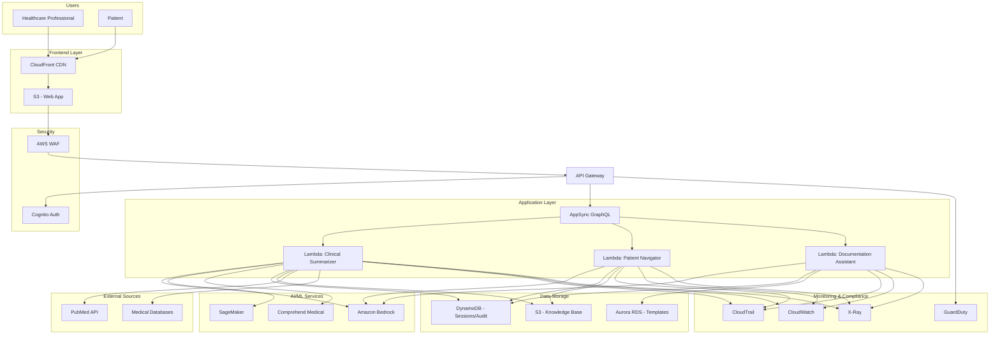

# Healthcare AI Assistant - AWS Architecture

## Architecture Diagram



## Architecture Components

### Frontend Layer
- **CloudFront CDN**: Global content delivery for low latency
- **S3 Static Website**: Hosts React/Vue web application

### Security Layer
- **AWS WAF**: Web application firewall for protection against common attacks
- **Amazon Cognito**: User authentication and authorization
- **GuardDuty**: Threat detection and monitoring
- **CloudTrail**: Audit logging for compliance

### API Layer
- **API Gateway**: RESTful API endpoint management
- **AppSync**: GraphQL API for real-time data synchronization

### Application Layer (Serverless)
- **Lambda - Clinical Summarizer**: Processes clinical information and medical literature
- **Lambda - Patient Navigator**: Handles patient education and care navigation
- **Lambda - Documentation Assistant**: Generates clinical documentation

### AI/ML Services
- **Amazon Bedrock**: Foundation models (Claude, Titan) for natural language processing
- **SageMaker**: Custom ML models for specialized medical tasks
- **Comprehend Medical**: Extract medical information from unstructured text

### Data Storage
- **DynamoDB**: NoSQL database for user sessions, interactions, and audit logs
- **S3**: Object storage for knowledge base, medical literature, and templates
- **Aurora RDS**: Relational database for structured templates and medical codes

### Monitoring
- **CloudWatch**: Metrics, logs, and alarms
- **X-Ray**: Distributed tracing for performance analysis

### External Integrations
- **PubMed API**: Access to medical research and literature
- **Medical Databases**: CDC, WHO, and other authoritative sources

## Key Features

### Scalability
- Serverless architecture with Lambda auto-scales based on demand
- DynamoDB provides single-digit millisecond latency at any scale
- CloudFront CDN ensures global availability

### Security & Compliance
- All data encrypted at rest (S3, DynamoDB, RDS) and in transit (TLS)
- Cognito provides secure authentication with MFA support
- WAF protects against SQL injection, XSS, and DDoS attacks
- CloudTrail maintains complete audit trail for HIPAA compliance
- VPC isolation for sensitive components

### Cost Optimization
- Serverless architecture: pay only for actual usage
- S3 Intelligent-Tiering for automatic cost optimization
- DynamoDB on-demand pricing for variable workloads
- CloudFront caching reduces origin requests

### High Availability
- Multi-AZ deployment for RDS Aurora
- DynamoDB global tables for disaster recovery
- S3 provides 99.999999999% durability
- Lambda automatically runs across multiple AZs

## Data Flow

### Clinical Summarization Flow
1. Healthcare professional submits clinical information via web app
2. Request passes through CloudFront → WAF → API Gateway
3. Cognito validates user authentication
4. API Gateway routes to Clinical Summarizer Lambda
5. Lambda retrieves context from S3 Knowledge Base
6. Bedrock processes information and generates summary
7. Comprehend Medical extracts medical entities
8. Results stored in DynamoDB with audit trail
9. Response returned to user

### Patient Education Flow
1. Patient submits health question
2. Request authenticated and routed to Patient Navigator Lambda
3. Lambda checks for emergency keywords
4. If emergency: immediate response with emergency contacts
5. Otherwise: retrieves information from Knowledge Base
6. Bedrock translates to plain language
7. Response includes disclaimer and care navigation guidance
8. Interaction logged for feedback analysis

### Documentation Assistance Flow
1. Healthcare professional provides encounter information
2. Documentation Assistant Lambda selects appropriate template from RDS
3. Bedrock generates structured documentation
4. Medical codes suggested based on content
5. Missing elements flagged for review
6. Draft documentation returned with review notice

## Compliance Considerations

### HIPAA Compliance
- **Synthetic Data Only**: System designed to process only synthetic or de-identified data
- **Audit Logging**: CloudTrail logs all API calls and data access
- **Encryption**: All data encrypted at rest and in transit
- **Access Controls**: IAM policies enforce least privilege access
- **Data Retention**: Configurable retention policies in DynamoDB and S3

### Safety Guardrails
- Input validation prevents processing of real patient data
- All outputs include appropriate disclaimers
- System never provides diagnosis or prescriptions
- Emergency detection triggers immediate escalation

## Cost Estimate (Monthly)

For moderate usage (10,000 requests/day):

- **Lambda**: ~$50 (1M requests, 512MB, 3s avg)
- **API Gateway**: ~$35 (10M API calls)
- **DynamoDB**: ~$25 (on-demand, 1GB storage)
- **S3**: ~$10 (100GB storage, 1M requests)
- **Bedrock**: ~$200 (varies by model and tokens)
- **CloudFront**: ~$50 (1TB data transfer)
- **RDS Aurora**: ~$150 (db.t3.medium)
- **Other Services**: ~$30 (CloudWatch, X-Ray, etc.)

**Total**: ~$550/month (scales with usage)

## Deployment

### Infrastructure as Code
Use AWS CDK or CloudFormation to deploy:

```bash
# Using AWS CDK
cdk deploy HealthcareAIStack

# Using CloudFormation
aws cloudformation create-stack --stack-name healthcare-ai --template-file template.yaml
```

### CI/CD Pipeline
- CodePipeline for automated deployments
- CodeBuild for Lambda function builds
- CodeDeploy for blue/green deployments
- Automated testing with property-based tests

## Monitoring & Alerts

### CloudWatch Alarms
- Lambda error rate > 1%
- API Gateway 5xx errors
- DynamoDB throttling events
- Bedrock API latency > 5s

### Dashboards
- Real-time request metrics
- User interaction analytics
- AI model performance
- Cost tracking

## Future Enhancements

1. **Multi-Region Deployment**: Active-active setup for global availability
2. **Advanced Analytics**: Redshift for data warehousing and analytics
3. **Voice Interface**: Integration with Amazon Lex
4. **Mobile Apps**: Native iOS/Android with AWS Amplify
5. **Real-time Collaboration**: WebSocket support via AppSync subscriptions
